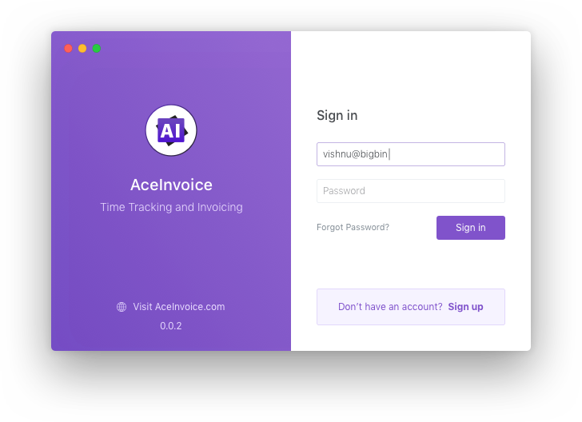
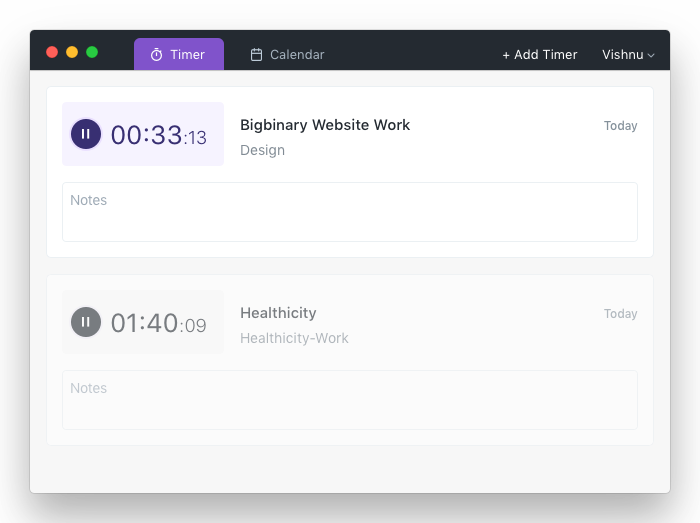
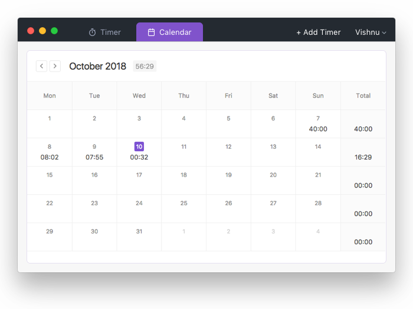
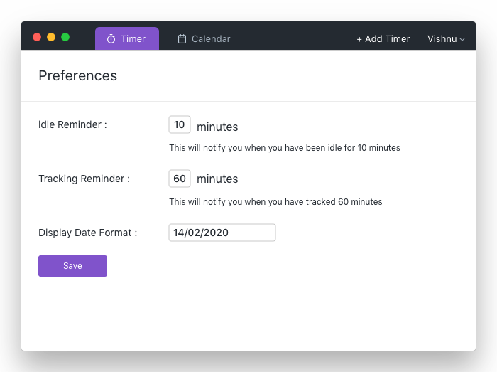

# AceInvoice-Electron

Time tracking application for Mac OS.

### Website

- Visit [https://www.aceinvoice.com/](https://www.aceinvoice.com/)

## Features

- OSX installer
- Native desktop Notifications
- Auto spell checking for notes
- Multiple organizations support
- Multiple timer support
- Calculating Idle time
- View monthly summary
- Ability to change preferences for date & notifications

### Screenshots

1. Login Screen

2. Timer Screen

3. Monthly Summary

4. Preferences

## How to install

[prod]: https://github.com/bigbinary/aceinvoice-distribution/releases

1. Download [AceInvoice-x.x.x.dmg][prod] from the [releases][prod], be careful what version you pick. Releases that end with `-beta` are beta releases and the rest are stable.

2. Open the file and drag the app into the `Applications` folder
3. Done!
